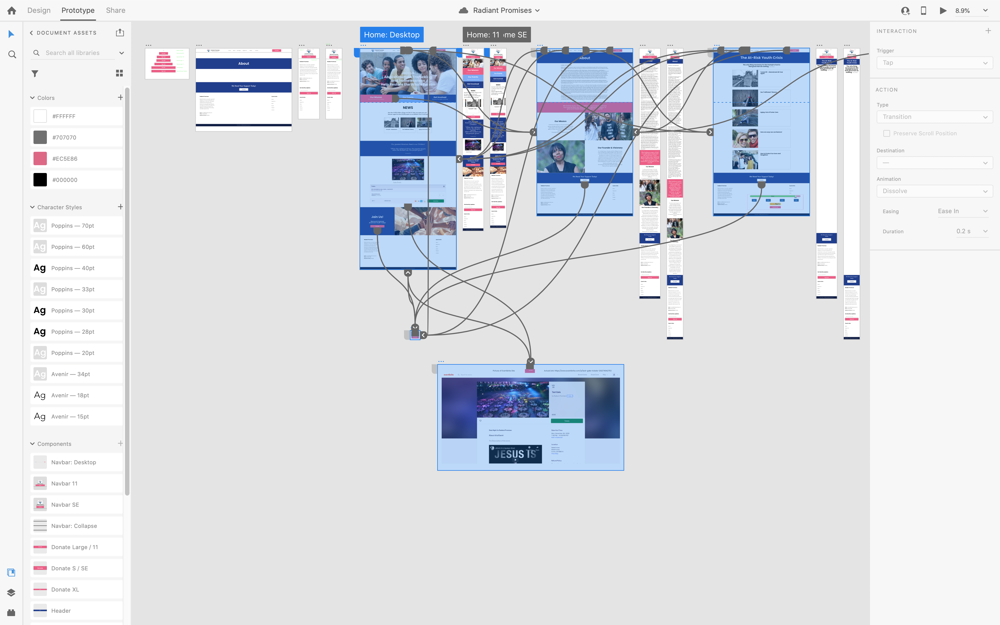

# Radiant Promises
Website design for 6-12 month life enhancement program for homeless young adults (age 18-24) who have aged out of the foster care system and those who have been rescued from sex-trafficking.

The donations platform was built on a Python/Django stack using Stripe payment processing and Twilio SMS Communications.

  
  
  
  
  
  

